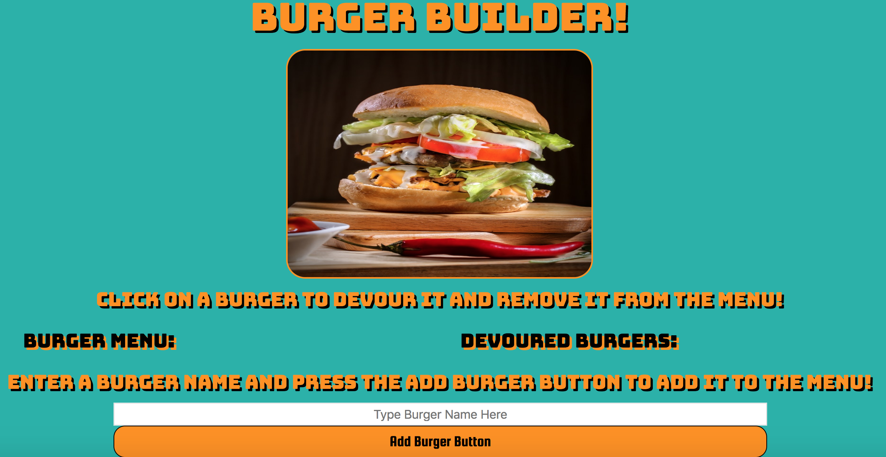
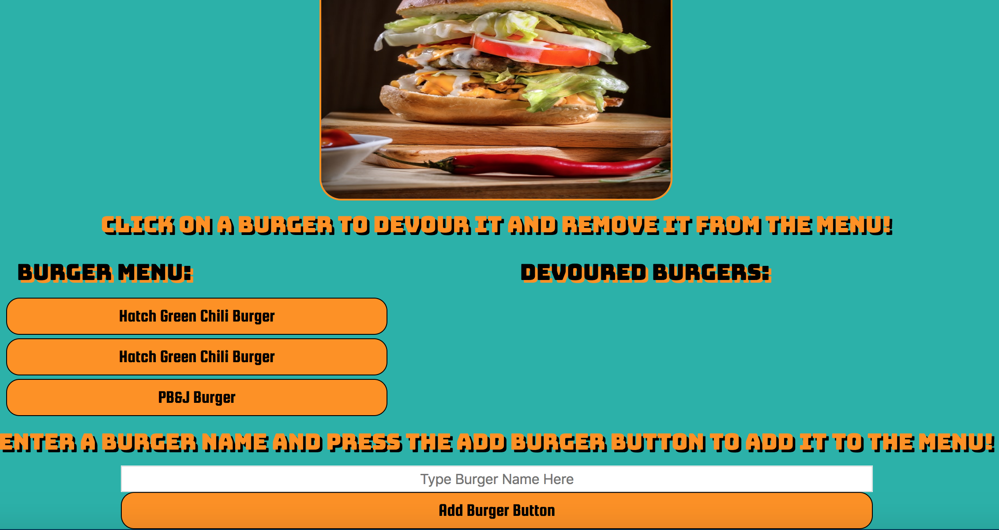
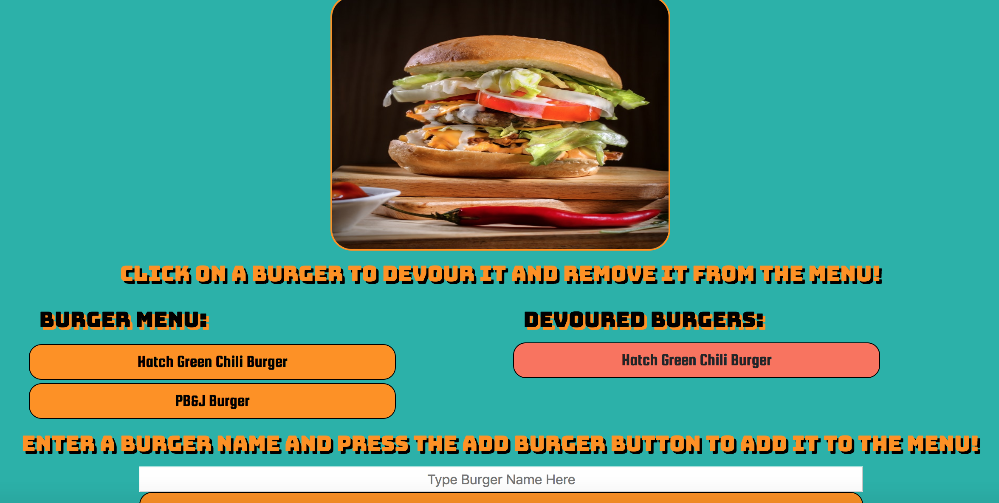

# Burger Builder App
An app that allows users to build there own burgers and add it to a menu. Burgers can then be "devoured" or removed from the menu. 
### **Description:**
This is a heroku application that invites users to create their own delicious burgers and add them to a menu for later reference by clicking the submit button. Users can also remove any burgers from the menu when the burger is clicked. This app uses various technologies as described below. All data is stored and updated in a mySQL database. HTML elements are added dynamically through Handlebars and the app is built using an MVC format.
 

_____

### **Running the App Through Node**
* Open Terminal or Gitbash
* Clone Repo
* within the directory of the repo, install Node packages:
    * npm install express (https://www.npmjs.com/package/express)
    * npm install express-handlebars (https://www.npmjs.com/package/express-handlebars)
    * npm install mySQL (https://www.npmjs.com/package/mysql)
* Run <node server.js> in the terminal.
 

_____

### **Running the App Through Heroku**
1. Follow the link to the app deployed in heroku:
    * Heroku Link: (https://floating-taiga-13510.herokuapp.com/)
 

_____

### **Demo Screenshots**
#####Burger Builder
* This is what the main-page looks like!

* When new burgers are ADDED to the menu!

* When new burgers are REMOVED from the menu!

_________

### **Technologies Used**
* Node.js
* Express
* HTML5
* CSS
* Bootstrap
* JavaScript
* Express NPM package (https://www.npmjs.com/package/express)
* Handlebars NPM Package (https://www.npmjs.com/package/express-handlebars)
* mySQL NPM Package (https://www.npmjs.com/package/mysql) 

_____

### **Built With**
* Visual Studio Code
* Terminal/Gitbash